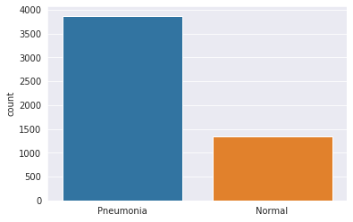
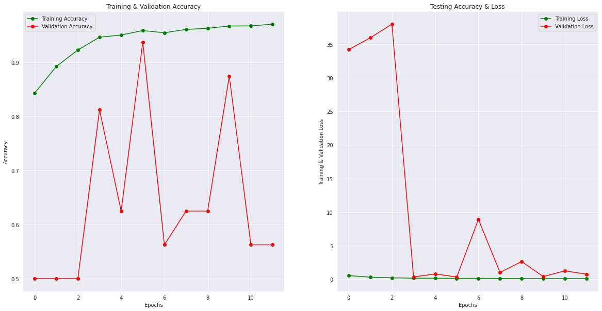
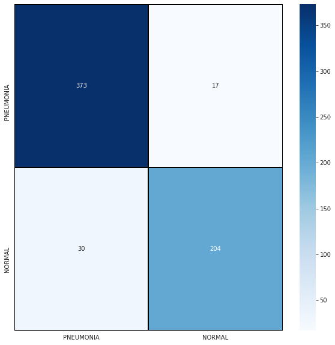
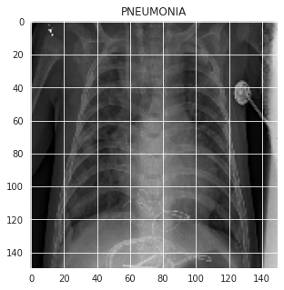
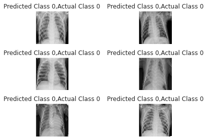
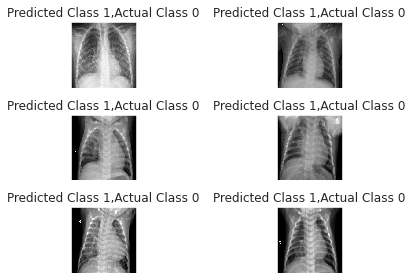

# 🩺Pneumonia Detection using CNN (TensorFlow & Keras)

This project demonstrates a **Convolutional Neural Network (CNN)** built with **TensorFlow & Keras** to detect **pneumonia** from chest X-ray images.  
The model is trained on the [Kaggle Chest X-Ray Pneumonia Dataset](https://www.kaggle.com/datasets/paultimothymooney/chest-xray-pneumonia).

---

##  Workflow

### 1. Data
- Dataset contains **Pneumonia** and **Normal** chest X-rays.  
- Distribution is imbalanced, with more pneumonia cases.

### 2. Preprocessing
- Resized all images to `224x224`.  
- Normalized pixel values (0–255 → 0–1).  
- Applied **data augmentation**:
  - Rotation
  - Width/Height shifts
  - Zoom
  - Horizontal flips  

### 3. Model Architecture
Implemented a **CNN** with:
- Convolutional + MaxPooling layers  
- Dropout for regularization  
- Fully connected Dense layers  
- Final **Sigmoid** layer for binary classification (Pneumonia vs Normal)  

### 4. Training
- Optimizer: **Rmsprop**  
- Loss: **Binary Crossentropy**  
- Metric: **Accuracy, F1 score, Recall**  
- Epochs: 12  
- Batch size: 32  
  
Training & Validation Performance:

### 5. Results
- **Test Accuracy**: ~92%  
- **Confusion Matrix**:

- Example Pneumonia X-ray:

---

## 📊 Evaluation
- The model correctly identifies most pneumonia cases.  
- Small misclassifications occur, but results are promising for clinical decision support.  

- Some Correct Predictions :

- Some Incorrect Predictions :

---

